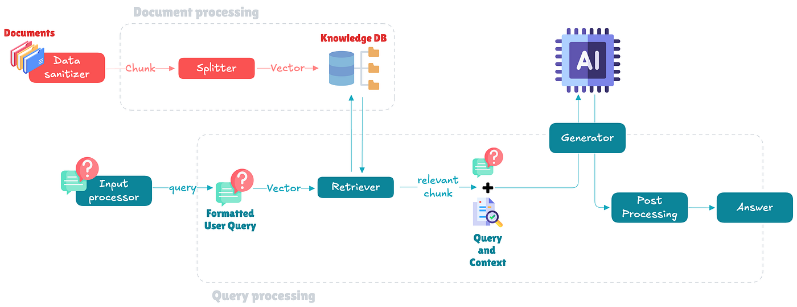
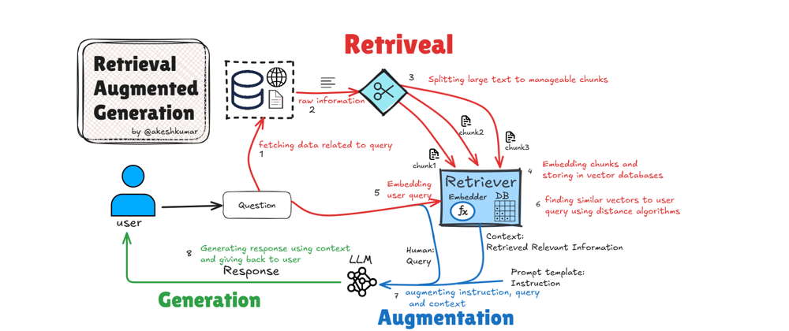

# RAG Document Q&A using LLAMA 2 and ChromaDB

## Overview

This project involves creating a Retrieval-Augmented Generation (RAG) system utilizing Meta's Llama 2.0 model, integrated with ChromaDB as the vector store and LangChain. The system demonstrates how to enable efficient document retrieval and question answering (QA) without fine-tuning the Large Language Model (LLM). By leveraging Llama 2.0, LangChain, and ChromaDB, we aim to process and query textual data effectively.

## RAG Architecture
### Architecture Overview

### Retriveal Overview

## Objective

The goal is to use Llama 2.0, LangChain, and ChromaDB to create a RAG system. This setup enables us to ask questions about documents (not included in the model's training data) by combining retrieval and generation. RAG ensures that relevant documents are retrieved from a vector database and utilized to provide contextually accurate responses.

## Features
- **Document Database Creation**: Utilizes ChromaDB to store and manage documents as high-dimensional vectors.
- **Embedding Generation**: Employs HuggingFace embeddings to transform textual data into numerical vector representations.
- **Vector Database**: Constructs a ChromaDB-based vector database for efficient similarity search and retrieval.
- **Retriever Integration**: Implements a retriever to fetch relevant documents based on query embeddings.
- **QA System**: Uses Llama 2.0 for generating accurate answers based on the retrieved documents.

## Definitions
- **LLM**: Large Language Model.
- **Llama 2.0**: An LLM from Meta, optimized for various NLP tasks.
- **LangChain**: A framework for building applications with LLMs.
- **Vector Database**: A database that organizes data using high-dimensional vectors for similarity search.
- **ChromaDB**: A vector database used for storing and retrieving document embeddings.
- **RAG**: Retrieval-Augmented Generation, a system combining retrieval and generation for enhanced QA capabilities.

## Model Details
- **Model**: Llama 2.0.
- **Variation**: 7B-chat-hf (7 billion parameters, HuggingFace build).
- **Version**: V1.
- **Framework**: PyTorch.

Llama 2.0 is a powerful open-source model, pretrained and fine-tuned with 2 trillion tokens, offering significant improvements over its predecessor, Llama 1. It includes parameter variations ranging from 7 to 70 billion, making it suitable for a wide range of NLP applications.

## What is a Retrieval-Augmented Generation (RAG) System?

RAG systems enhance the performance of LLMs by integrating external resources. While LLMs excel in understanding context and answering questions based on their training data, they may hallucinate when encountering unknown information. RAG addresses this limitation by combining two components:

1. **Retriever**: Encodes and indexes external documents as vectors for efficient retrieval. This encoding is performed using embeddings generated by models trained for this purpose. ChromaDB, used in this project, is an example of an open-source vector database. Other options include FAISS, Pinecone, and Weaviate.

2. **Generator**: Utilizes an LLM to generate responses based on retrieved documents. In this project, we use a quantized Llama 2.0 model.

LangChain orchestrates the retriever and generator, enabling the creation of a receiver-generator pipeline with minimal effort.

## How It Works

1. **Embedding Creation**: The project begins by generating embeddings for input documents using HuggingFace embeddings. These embeddings transform textual data into numerical vectors suitable for similarity operations.

2. **Persisting Data**: A directory named `doc_db` is created to store the vectorized documents. This ensures embeddings are reused without recalculation.

3. **Vector Database Setup**: ChromaDB is used to construct a vector database, enabling efficient similarity searches and document retrieval.

4. **Retriever Setup**: A retriever is initialized from the vector database to fetch relevant documents based on query embeddings.

5. **LLM Integration**: The Llama 2.0 model (7B-chat-hf variation) is integrated with a temperature setting of 0 for deterministic responses.

6. **QA Chain Creation**: A QA chain is implemented using LangChain's `RetrievalQA` class, combining the retriever and LLM to process user queries and provide answers with source document references.

7. **Query Execution**: The QA chain is tested with sample queries. The output includes the answer generated by the Llama 2.0 model and the corresponding source document.

## Project Structure
- **Data Loading**: Loads textual data for embedding generation.
- **Database Creation**: Builds and persists the vectorized document database.
- **Query Processing**: Implements retrieval-based query handling to fetch relevant information.
- **Model Integration**: Integrates the Llama 2.0 model for robust answer generation.

